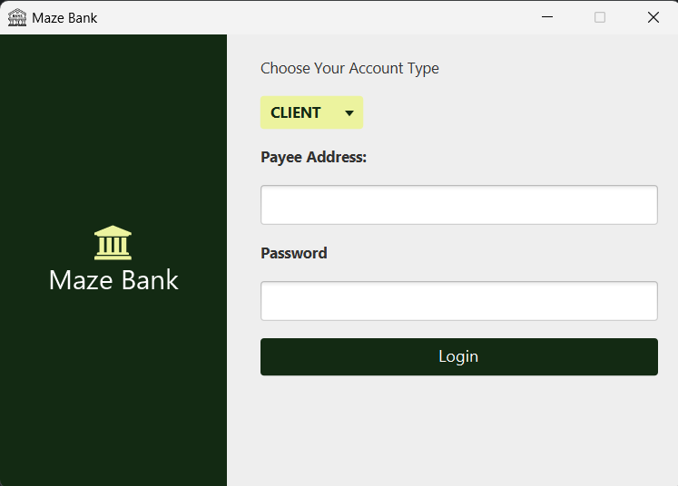
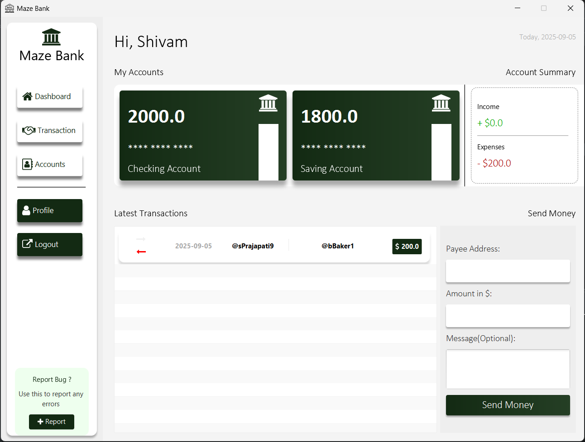
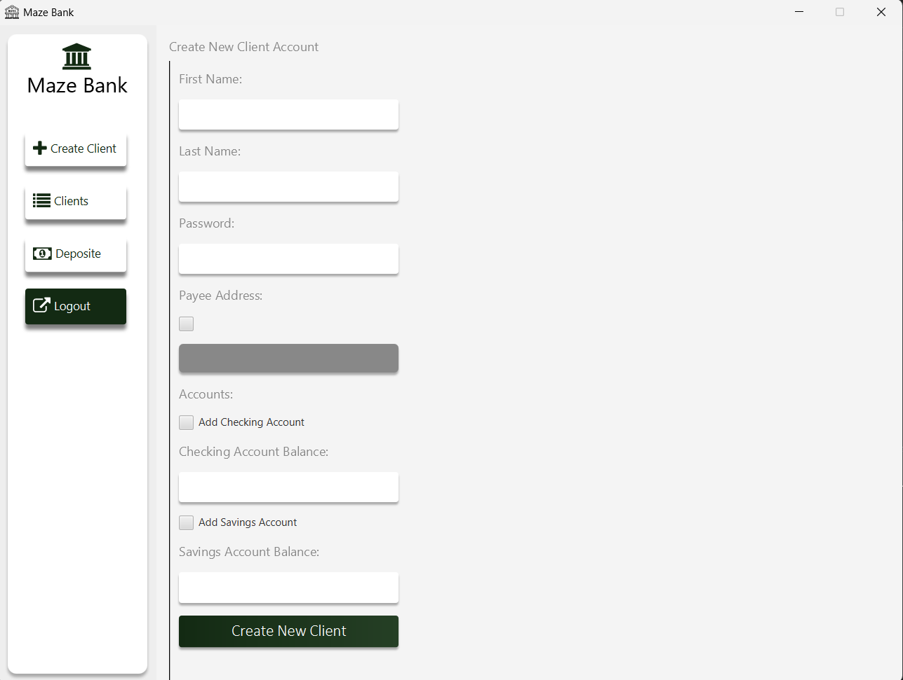

# 🏦 MazeBank

MazeBank is a **JavaFX + Maven Banking Application** built in Eclipse.  
It uses **SQLite** as the database and provides a modern GUI with features like **login, dashboard, transactions, and reports**.

---

## ✨ Features
- 🔐 User Login & Logout  
- 📊 Dashboard View  
- 💳 Transactions Management  
- 👤 Profile Section  
- 📑 Reports  
- 🎨 Styled with CSS + FontAwesome Icons  

---

## 🚀 Tech Stack
- **Java 17**  
- **JavaFX 21**  
- **Maven**  
- **SQLite (JDBC)**  
- **Eclipse IDE**  

---
## 📂 Project Structure

```plaintext
MazeBank/
│── src/main/java          # Application source code
│   └── com.jmc.mazebank   # Controllers, Models, Views
│── src/main/resources     # FXML, CSS, assets
│── pom.xml                # Maven dependencies
│── README.md              # Project documentation
│── screenshots/           # App screenshots
```

## 📸 Screenshots

### 🔐 Login Page


### 📊 Client


### 💳 admin



## ▶️ How to Run

### From Terminal
# Build the project
mvn clean install

# Run JavaFX application
mvn javafx:run
